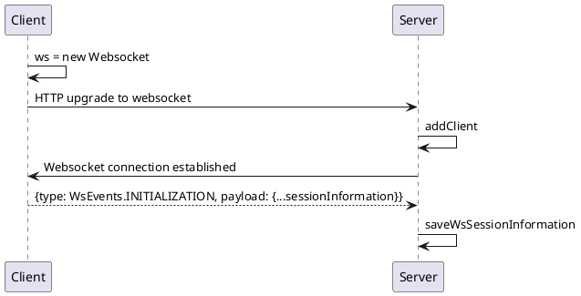
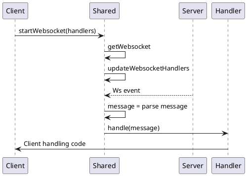
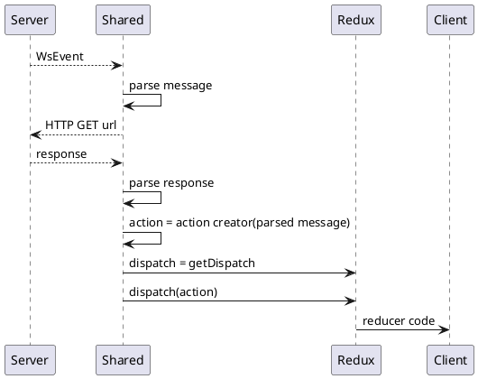

# WS

All websocket communications must have a messageType and payload.
All messagetypes are based on events/actions that occur within the different applications.

## Setting up a websocket connection

Three options where considered for creating a websocket connection that is linked to a quiznight.

1. Create a HTTP session first and copy the session contents to the websocket object. This did not work very well because the session cookie is linked to the host and not bound to a port, meaning that when you use multiple clients during testing your session gets overriden at unepxected moments.

2. Same as option 1 but split session according to the different cleints e.g.: `req.session.team.x` and `req.session.master.x`. This causes simmular issues compared to option 1 when using multiple team clients.

3. Send a websocket initialization message with the session information and store this in the websocket object. This is the option we settled for.



## Usage with the shared module



The clients/shared module (from now on shared) offers functionality to make working with websockets a little bit easier.
Shared offers a mechanism for handling websocket events according to their type.
Building handlers for shared is easy with the builders provider:

```js
 new WebsocketHandlersBuilder()
    .on(WsEvents.ON_TEAM_APPROVAL) // Register the next handler to this WS event, which should be the type field of a JSON websocket message
        .fetch(`quiz-nights/${quizPin}/teams`, setParticipatingTeams) // Do a HTTP GET to the url and pass the parsed JSON respone into the action creator. The result of the action creator will be dispatched to the store registered to the shared module
    .on(WsEvents.ON_QUESTION)
        .doAction((message) => history.push(Pages(quizPin, message.roundNumber, message.questionNumber).QUESTION)) // Execute code that takes the parsed JSON WS message as argument
    .build();
```

### Fetch

Onderstaande diagram geeft een overzicht van hoe een fetch wordt uitgevoerd op basis van de bovenstaande builder code. Het deel over het dispatchen naar redux is versimpled.
In werkelijkheid moet de client eerst de store opslaan bij shared en wordt de dispatch bepaald bij het opzetten van de websocket.



## messageType onTeamApply

**@payload:**

```js
{
    teamName: "de billy butchers"
}
```

___

## messageType: onAnswer

**@payload:**

```js
{
    teamName: "de billy Butchers",
    answer: "answer to silly question"
}
```

___

## messageType: onQuestion

**@payload:**

```js
{
    category: "sport",
    question: "Interesting question about sport.",
    questionNumber: 1,
    roundNumber: 1
}
```

___

## messageType: onQuestionClose

**@payload:**

```js
 [
    {
        teamName:"de billy butchers",
        answer: "parijs",
        isCorrect: true
    },
    {
        teamName:"super-coole-teamnaam",
        answer: "bordaux",
        isCorrect: false
    }
]
```

___

## messageType: onRoundEnd

**@payload:**

```js

[
    {
        teamName: "de billy butchers",
        correctQuestions: 1,
        roundPoints: 4
    },
    {
        teamName: "super-coole-teamnaam".
        correctQuestions: 0,
        roundPoints: 0
    }
]

```

___

## messageType: onQuizNightEnd

**@payload:**

```js
[
    {
        teamName: "de billy butchers",
        correctQuestions: 1,
        roundPoints: 4
    },
    {
        teamName: "super-coole-teamnaam".
        correctQuestions: 0,
        roundPoints: 0
    }
]
```

___

## messageType: onTeamApprovel

**@description:** Returns true or false depending on if team is approved or not.
**@payload:**

```js
{
    approved: true
}
```
