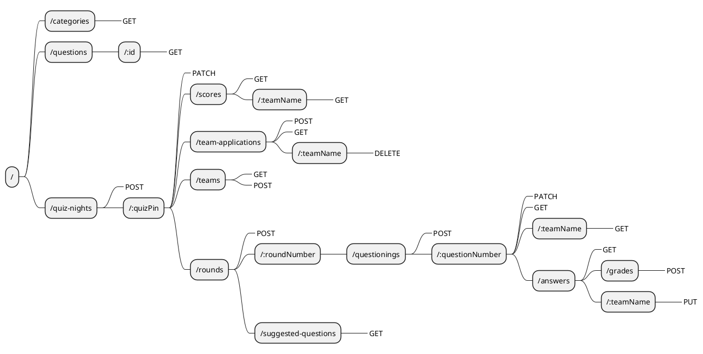

# REST-API routes

## Introduction

This markdown file is an overview of all available REST-routes for the Quizzer api v1. All routes assume a root of `/api/v1/`.

Each route has the following information:

- Route
- Method
- Body
- Optionally a description
- Possible responses
  - Status code
    - In case of an error, what caused the error
  - Body

## Overview

The following diagram shows all available routes with their supported methods.



## Route descriptions

### /categories

#### GET

_Description:_
Gets all available categories

##### Responses

###### 200

**Body**
```js
[
    "Algemeen",
    "Sport",
    "Wetenschap & techniek"
]
```

___

### /questions/:id

#### GET

_Description:_
Gets the question with the given id

##### Responses

###### 200

When the id exists
**Body**
```js
{
    "_id": "5f9a7cd5009c3613b49bcc14",
    "question": "Hoe wordt een middagdutje zoals dit bijvoorbeeld in Spanje wordt gehouden genoemd?",
    "answer": "Een siësta",
    "category": "Algemeen",
    "orderNumber": 0.07511334721142338,
}
```

###### 404

When the id does not exist

___

### /quiz-nights

#### POST

_Description:_
Creates an empty quiz-night en returns the generated quizpin. The quizpin is always at least 6 digits.

##### Responses

###### 200

**Body:**
```js
{
    "quizPin": 661178
}
```

___

### /quiz-nights/:quizPin

#### PATCH

**Body:**

_Description:_
To end a quiz-night and notify the participating teams and scoreboards

```js
{
    isActive: false
}
```

_Description:_
To close the application period for a quiz-night

```js
{
    isOpenForApplication: false
}
```

##### Responses

###### 200

###### 404

When the quizpin does not exist

____

### /quiz-nights/:quizPin/scores

#### GET

_Description:_
Gets the current scores of al teams in a quiz night

##### Responses

##### 200

**Body:**

```js
[
    {
        "roundPoints": 0,
        "numberOfCorrectQuestions": 0,
        "teamName": "Erik"
    },
    {
        "roundPoints": 0,
        "numberOfCorrectQuestions": 0,
        "teamName": "Tom"
    }
]
```

##### 404

When the quizpin does not exist

___

### /quiz-nights/:quizPin/scores/:teamName

#### GET

_Description:_
Gets the score and placing for a specific team 

#### Responses

##### 200 

**Body:**

```js
{
    "teamName": "Erik",
    "roundPoints": 0,
    "numberOfCorrectQuestions": 0,
    "placing": 2
}
```

##### 404

When the quizpin or teamname does not exist

___

### /quiz-nights/:quizPin/team-applications

#### POST

_Description:_
Adds a team to the team applications and notifies the quizmaster there has been a change in team applications.

**Body:**
```js
{
    teamName: "Erik"
}
```

##### Responses

###### 200

###### 404

When the quizpin does not exist
___

#### GET

_Description:_
Returns a list of all teams that requested to join the quiznight and have not been rejected

#### Responses

##### 200

**Body:**

```js
[
    "Erik",
    "Tom"
]
```

##### 404

When the quizpin does not exist

___

### quiz-nights/:quizPin/team-applications/:teamName

#### DELETE

_Description:_
Removes a team application and notifies the associated socket of its rejection

##### Responses

###### 200

###### 404

When the quizpin or teamname does not exist

___

### /quiz-nigts/:quizPin/teams

#### GET

_Description:_
Gets the approved teams of a quiznight

##### Responses

###### 200

**Body:**

```js
[
    "Tom"
]
```

###### 404

When the quizpin does not exist
___

#### POST

_Description:_
Approves a given team and notifies the connected team and scoreboard(s)

**Body:**

```js
{
    teamName: "Tom"
}
```

##### Responses

###### 200

###### 404

When the quizpin does not exist
___

### /quiz-nights/:quizPin/rounds

#### POST

_Description:_
Creates a round in a quiznight with the categories

**Body:**

```js
[
    "Techniek",
    "Muziek",
    "Sport"
]
```

##### Responses

###### 200

**Body:**

```js
{
    roundNumber: 1
}
```

###### 400

When there are not exactly 3 categories supplied in the body

###### 404

When the quizpin does not exist

___

### /quiz-nights/:quizPin/rounds/:roundNumber/questionings

#### POST

_Description:_
Creates a questioning for each team in the quiz night and notifies the teams and scoreboards of the new questioning

**Body:**

```js
{
    questionId: "5f9a7cd5009c3613b49bcc14"
}
```

##### Responses

###### 200

**Body:**

```js
{
    quizPin: 583856,
    roundNumber: 1
    questionNumber: 2
}
```

###### 404

When the quizpin does not exist

___

### /quiz-nights/:quizPin/rounds/:roundNumber/questionings/:questionNumber

#### PATCH

_Description:_
Used to close a questioning for all teams in a quiznight and notifies teams and scoreboard the questioning has been closed.

**Body:**

```js
{
    isOpen: false
}
```

##### Responses

##### 200

##### 404

When the quizpin or questionnumber does not exist
___

#### GET

_Description:_
Finds a question associated with a questioning for the given combination of quizPin, roundNumber and questionnumber.

##### Responses

###### 200

**Body:**

```js
{
    question: "Hoe hoog is de domtoren",
    answer: "112 meter",
    category: "Architectuur"
}
```

###### 404

When quizpin, roundNumber or questionNumber does not exist

___

### /quiz-nights/:quizPin/rounds/:rounNumber/questionings/:questionNumber/:teamName

#### GET

_Description:_
Finds a question associated with a questioning for the given combination of quizPin, roundNumber, questionnumber and teamName.

##### Responses

###### 200

**Body:**

```js
{
    question: "Hoe hoog is de domtoren",
    answer: "112 meter",
    category: "Architectuur"
}
```

###### 404

When quizpin, roundNumber, questionNumber or teamName does not exist
___

### /quiz-nights/:quizPin/rounds/:rounNumber/questionings/:questionNumber/answers

#### GET

_Description:_
Gets all answers and current grades for questionings within the specified round with the specified questionNumber

##### Responses

###### 200

**Body:**

```js
[
    {
        teamName: "Erik",
        isCorrect: false,
        answer: "96 meter"
    },
    {
        teamName: "Tom",
        isCorrect: true,
        answer: "115 meter"
    }
]
```

###### 404

When quizpin, roundNumber or questionNumber does not exist

___

### /quiz-nights/:quizPin/rounds/:rounNumber/questionings/:questionNumber/answers/grades

#### POST

_Description:_
Saves the grades for all questionings identified by the combination of roundNumber, questionNumber and quizPin. 
When the graded question has a question number that is equal to the maximum number of questions in a round the scores are calculated and saved.
In all cases the scoreboard is notified of the change in grading.

**Body:**

```js
[
    {
        teamName: "Erik",
        isCorrect: true
    },
    {
        teamName: "Tom",
        isCorrect: false
    }
]
```

##### Responses

###### 200

###### 404

When the quizpin, roundNumber or questionNumber does not exist

___

### /quiz-nights/:quizPin/rounds/:rounNumber/questionings/:questionNumber/answers/:teamName

#### PUT

_Description:_
Saves an answer for a questioning and resets it's correctness. Notifies the scoreboard and master of the change in answer.

**Body:**

```js
{
    answer: "112 meter"
}
```

##### Responses

###### 200

###### 400

When the question does not accept answers any more because it was closed

###### 404

When the quizpin, roundNumber, questionNumber or teamName does not exist

___

### /quiz-nights/:quizPin/rounds/:roundNumber/suggested-questions?offset=:offset&limit=:limit

#### GET

_Description:_
Gets a subset of questions that can be asked given the chosen categories in a round and the questions already asked in the quiznight.

##### Responses

###### 200

**Body:**

```js
[
    {
        category: "Architectuur",
        question: "Hoe hoog is de dom toren",
        _id: "5f9a7cd5009c3613b49bcc14"
    },
    {
        category: "Sport",
        question: "Wat is de grootste jeugdvereniging van Nederland",
        _id: "5f9a7cd5009c3613b49bcc15"
    }
]
```

###### 404

When the quizpin or roundNumber does not exist

___
