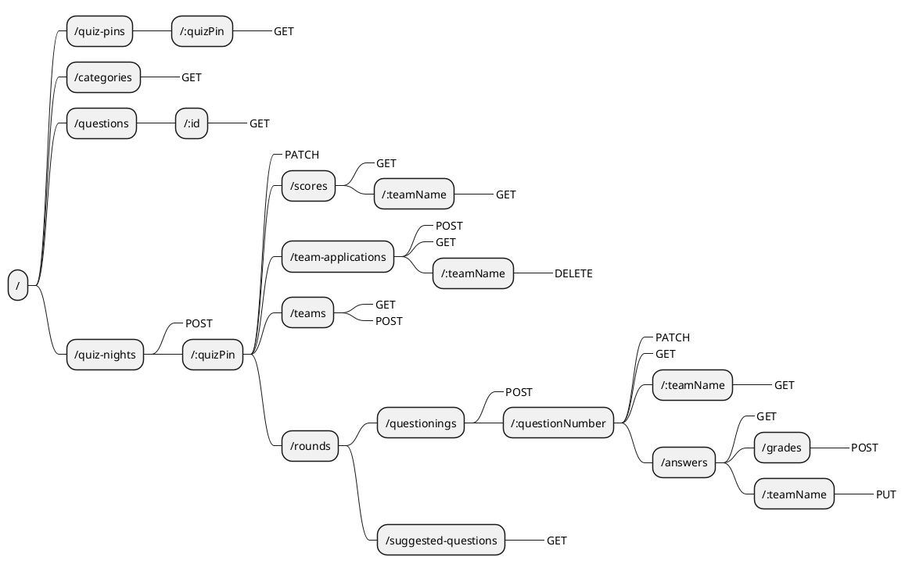

# REST-API routes

# Introduction

This markdown file is an overview of all available REST-routes for the Quizzer api v1. All routes assume a root of `/api/v1/`.

Each route has the following information:

- Route
- Method
- Body
- Optionally a description
- Possible responses
  - Status code
    - In case of an error, what caused the error
  - Body

# Overview

The following diagram shows all available routes with their supported methods.

