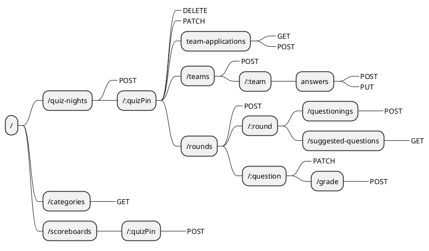
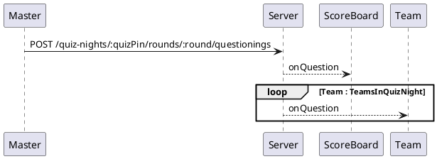

# REST-API routes

# Introduction

This markdown file is an overview of all available REST-routes for the Quizzer api v1. All routes assume a root of `/api/v1/`.

Each route has the following information:

- Route
- Method
- Body
- Optionally a description
- Possible responses
  - Status code
    - In case of an error, what caused the error
  - Body

# Overview

The following diagram shows all available routes with their supported methods.



# Master routes

## /quiz-nights

**@method:** POST
**@body:**
none

#### @response

##### 200

```js
{
  quizPin: 103441;
}
```

___

## /quiz-nights/:quizPin

**@method:** DELETE
**@body:** *None*

#### @response

##### 200

**@body:** *none*

##### 404

**@description:** when quizPin does not exist.
**@body:**

```js
{
    error: "Quiz-night does not exist"
}
```

___

## /quiz-nights/:quizPin

**@method:** PATCH
**@body:**

```js
{
  isOpenForApplication: true;
}
```

#### @response

##### 200

**@body:** _none_

##### 404

**@description:** When quizPin does not exist.
**@body** _none_

___

## /quiz-nights/:quizPin/teams/

**@method:** POST
**@body:**

```js
{
  teamName: "super-cool-team";
}
```

#### @response

##### 200

**@body:** _none_

##### 409

**@description:** When teamName already exists in quiz.

##### 404

**@description:** When quizPin does not exist.
___

## /quiz-Nights/:quizpin/team-applications

**@method:** POST
**@body:**

```js
{
    teamName: "de billy Butchers"
}

```

#### @response

##### 200

**@body:** _none_

##### 400

**@description:** When the quiznight no longer accepts applications
**@body:**
```js
{
    error: 'The quiz-night is not accepting applications'
}
```

___

**@method:** GET
**@body:** _none_

#### @response

##### 200

**@body:**
```js
[
    "super coole teamname",
    "jack sparrow"
]
```
___

## /quiz-nights/:quizPin/team-applications/:teamName

**@method:** DELETE

#### @response

##### 200

**@body:** _none_
___

## /categories

**@method:** GET

#### @response

##### 200

**@body:**

```js
 [
        "sport",
        "kunst"
 ]
```

___

## /quiz-nights/:quizPin/round

**@method:** POST
**@body**

```js
[
    "sport",
    "kunst",
    "topografie"
]
```

#### @response

##### 200

**@description:** server bepaalt aan de hand van hoogste roundNumber wat het nieuwe roundNumber wordt.
**@body:**

```js
{
    roundNumber: 1
}
```

##### 400

**@description:** When less or more than 3 categories are posted.
**@body:**

```js
{
    error: "A round must have exactly 3 categories."
}
```

##### 404

**@description:** when quizPin does not exist.
___

## /quiz-nights/:quizPin/round/:round/suggestedQuestions/?:offset&:limit

**@method:** GET

##### 200

**@body:**

```js
[
    {
        categoryName: "kunst"
        questions: ["vraag1","vraag2"]
    },
    {
        categoryName: "sport"
        questions: ["vraag1","vraag2"]
    },
    {
        categoryName: "topografie"
        questions: ["vraag1","vraag2"]
    }
]
```

##### 400

**@description:** When less or more than 3 categories are posted.
**@body:**

```js
{
    error: "A round must have exactly 3 categories."
}
```

___

## /quiz-nights/:quizPin/rounds/:round/questionings

**@method:** POST
**@descripion:** Starts the asking of a question and informs the participation teams and scoreboard.



**@body:**

```js
{
    questionId: "asdf12"
}
```

#### @response

##### 200

**@body:** _none_

___

## /quiz-nights/:quizPin/rounds/:round/questionings/:question/grade

**@method:** POST
**@description:** if last question in round, score is also calculated and saved.
**@body:**

```js
[
    {
        teamName: "super-cool-team",
        grade: true
    },
    {
        teamName: "de billy butchers",
        grade: false
    }
]
```

#### @response

##### 200

**@body:** *None.*

**@TODO:** Error situaties
___

## /quiz-nights/:quizPin/rounds/:round/questionings/:question

**@method** PATCH
**@body:**

```js
{
    active: true
}
```

#### @response

##### 200

**@body:** *None*

##### 404

**@description:** When question is not found.
**@body:**

```js
{
    error: "Question not found"
}
```

___

# Scoreboard Routes

## scoreboards/:quizPin

**@method:** POST
**@Description:** Post quizPin to server to prepare Session for websocket connection.
**@body:** *None*

#### @response

##### 200

**@body:** *None*

##### 404

**@description:** when quizpin does not exist.
**@body:**

```js
{
    error: "No quiz-night with this pin was found."
}
```

___

# TeamApp

## /quiz-Nights/:quizPin/teams/:teamName/answers

**@method:** POST
**@body:**

```js
{
    roundNumber:1,
    questionNumber:1,
    answer: "answer to silly question"
}
```

#### @response

##### 200

**@body** *None*

##### 404

**@description:** can occur when either the round number or question number is not found.
**@body:**

```js
{
    error: "Round or question not found"
}
```

___

## /quiz-Nights/:quizPin/teams/:teamName/answers

**@method:** PUT
**@body:**

```js
{
    roundNumber:1,
    questionNumber:1,
    answer: "answer to silly question revised"
}

```

#### @response

##### 200

**@body** *None*

##### 404

**@description:** can occur when either the round number or question number is not found.
**@body:**

```js
{
    error: "Round or question not found"
}
```
