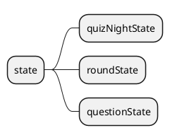

# clientState

## State overview

___

## Reducers

In this section the different reducers and their responsibillities will be documented.

### quizNightreducer

### roundreducer

### questionReducer

___