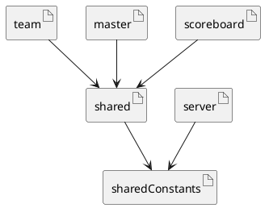

# Module structure

In the following diagrams the modules used by Quizzer are illustrated.
Note that these are the npm modules and not file level modules. And external dependencies have not been modelled.

shared re-export his imports. This makes it so that clients like team dont have to install shared-constants as well.

## shared

Shared is responsible for providing the code that can be shared between clients, this includes:

- shared action creators
- shared reducer
- websocket handling interface and helpers
- components, these components unfortunatly can't use react-bootstrap or hooks because of a runtime error we have not been able to fix yet.
- constanst only relevant to clients

It should be noted that althought reducers and action creators are shared, state is not automagically synced between clients, that is where REST and WS comes in.

## shared-constants

All constants that have to be used by all modules

- websocket events
- roles
- others...
