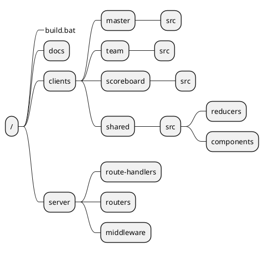

# Quizzer

## Introduction

This documentation is written using Markdown and Draw.io.
To read this document as intented it should be read using [VS Code](https://code.visualstudio.com/) and the following extensions:

- [Markdown Preview Enhanced](https://shd101wyy.github.io/markdown-preview-enhanced/#/) to be able to read all headings and plant uml snippets
- [vscode-drawio](https://marketplace.visualstudio.com/items?itemName=eightHundreds.vscode-drawio) to be able to read the drawio diagram

**Made by:** Erik Knaake & Tom Vermeer
___

## wireframes

Wireframes were made using draw.io and illustrate the different screens of our applications.
They also serve to identify routes,resources and events.

Components are only marked onces, once a component has been identified it cluters the wireframes when it is marked again. Due to an issue with layers not all marking is done in the same way, some components are colored and annotated with text, while some others have an extra dotted border around them.
[Wireframes](wireframes.drawio)
___

## Resources

Resources represent the data the application will me modifying and communicating with.
We have chosen to represent this in a domain model for readabillity.

concepts that are colored red are not used as resources withing the applications, they are shown to illustrate connection between the resources and the users.

[domainmodel](domain-model.drawio)
___

## Api-docs

[Api-docs](apiDocs.md)
___

## WS-docs

[Ws-docs](WSdocs.md)
___

## Mongoose-schema's

We have chosen to model 5 different schema's in for our application, altough we intend to only use 2 collections.
We decided to make the "questioningsSchema", "teamSchema" and "roundSchema" schemes to more easily handle our data in the frontend. These schema's however will not become their own collections but rather be embedded in the "quizNightSchema".

```js

const questioningsSchema = new mongoose.schema({
    teamName: String,
    question: String,
    answer: String,
    isCorrect: Boolean
})

const teamSchema = new mongoose.schema({
    teamName: String,
    numberOfCorrectQuestions: Number,
    roundPoints: Number,
})

const roundSchema = new mongoose.schema({
    chosenCategories: [String],  
    roundNumber: Number,
    questionings: [questioningsSchema],
})

const quizNightSchema = new mongoose.Schema({
  _id: Number, // quizPin
  teams: [teamSchema],
  rounds: [roundSchema],
});

const questionSchema = new mongoose.schema({
  _id: String, // question
  category: String,
  answer: String,
});

```

___

## Client-State

[Client State](clientState.md)
___

## Express-structure

[Express Structure](expressStructure.md)

## General Overview

